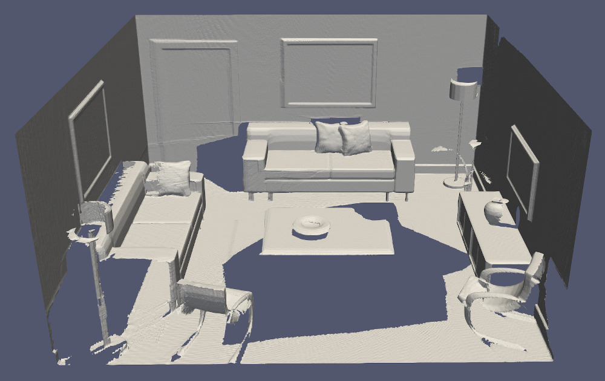
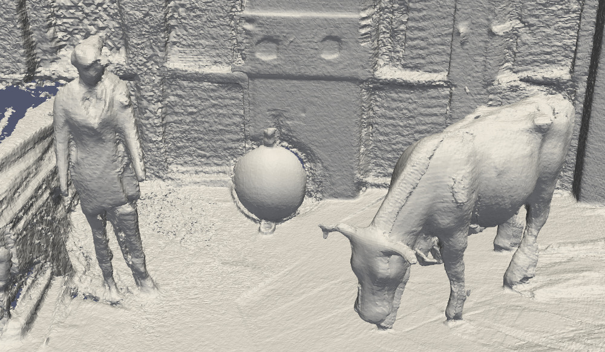
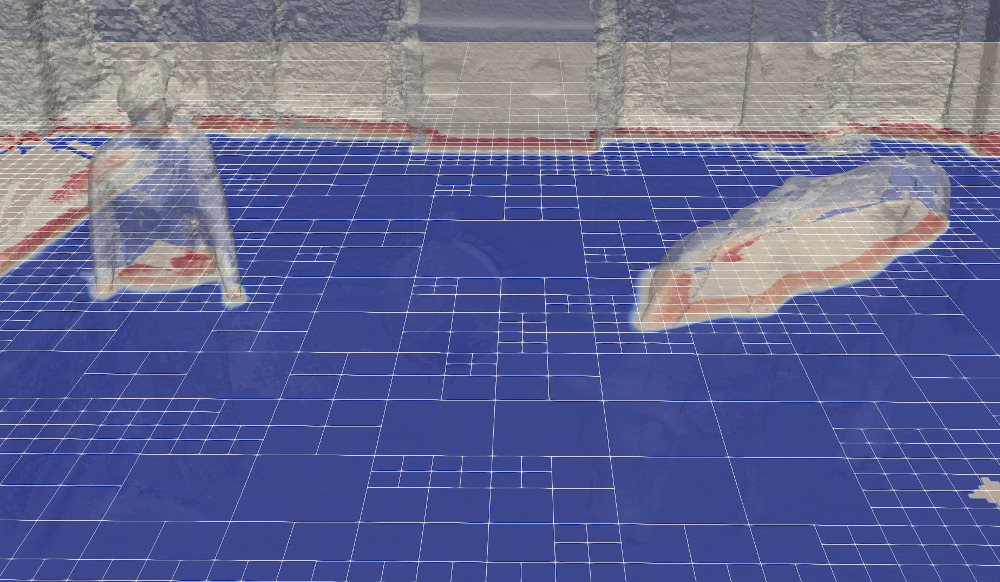

# supereight 2

Welcome to supereight 2: a high performance template octree library and a dense volumetric SLAM pipeline implementation.

supereight 2 is a complete rewrite of the
[original supereight](https://github.com/emanuelev/supereight). It adds
[state-of-the-art mapping features](https://arxiv.org/abs/2010.07929) while also
making the library more flexible and easier to use.

supereight 2 follows [semantic versioning](https://semver.org/).



## Build

Install the dependencies

* GCC 7+ or clang 6+
* CMake 3.10+
* Eigen 3
* OpenCV 3+
* GLut (optional, for the GUI)
* OpenNI2 (optional, for Microsoft Kinect/Asus Xtion input)
* Make (optional, for convenience)

On Debian/Ubuntu you can install all of the above by running:

``` sh
sudo apt --yes install git g++ cmake libeigen3-dev libopencv-dev freeglut3-dev libopenni2-dev make
```

Clone the repository and its submodules:

``` sh
git clone --recurse-submodules https://bitbucket.org/smartroboticslab/supereight2.git
cd supereight2
# If you cloned without the --recurse-submodules run the following command:
git submodule update --init --recursive
```

Build in release mode:

``` sh
make
# Or if you don't have/like Make do a standard CMake build
mkdir -p build/release
cd build/release
cmake -DCMAKE_BUILD_TYPE=Release ../..
cmake --build .
```


## Documentation

Online documentation can be found [here](https://supereight2.readthedocs.io).

If you have Doxygen installed you can build a local copy of the documentation in
`doc/html` by running `make doc`.


## Usage example

Download the ICL-NUIM datasets:

``` sh
make download-icl-nuim
```

Copy the configuration file into the dataset folder and run supereight:

``` sh
./build/release/app/supereight_tsdf_single_pinholecamera PATH/TO/dataset/living_room_traj0_frei_png/config.yaml
```

### 1. Setting up a map

The map is templated based on field type, colour, semantics, map resolution and block size.
The following map types are currently supported:

| Field Type | Colour | Semantics | Resolution |
|------------|--------|-----------|------------|
| TSDF       | OFF    | OFF       | Single     |
| TSDF       | OFF    | OFF       | Multi      |
| Occupancy  | OFF    | OFF       | Multi      |

Example snippet

``` cpp
// Setup a map
se::Map<se::Data<se::Field::TSDF, se::Colour::Off, se::Semantics::Off>, se::Res::Single, 8> map_custom(config.map, config.data);
se::TSDFMap<se::Res::Single> map(config.map, config.data)     tsdf_single_map(config.map, config.data);
se::TSDFMap<se::Res::Multi> map(config.map, config.data)      tsdf_multi_map(config.map, config.data);
se::OccupancyMap<se::Res::Multi> map(config.map, config.data) occupacny_multi_map(config.map, config.data);
```

### 2. Setting up a sensor

The following sensor types are currently supported:

| Sensor Type   |
|---------------|
| PinholeCamera |
| OusterLidar   |

Example snippet

``` cpp
// Setup a sensor
const se::PinholeCamera pinhole_camera(config.sensor, config.app.sensor_downsampling_factor);
const se::OusterLidar   ouster_lidar(config.sensor, config.app.sensor_downsampling_factor);
```

### 3. Setting up a reader

| Reader Type   | Scene Format                  | `sequence_path`        | GT Format                | `ground_truth_file`                    |
|---------------|-------------------------------|------------------------|--------------------------|----------------------------------------|
| TUM           | TUM rgb/depth                 | `path/to/dataset/`     | TUM ground truth         | `path/to/tum_groundtruth.txt`          |
| InteriorNet   | InteriorNet rgb/depth         | `path/to/dataset/`     | InteriorNet ground truth | `path/to/cam0.ccam`                    |
| Newer College | Newer College point cloud     | `path/to/pointclouds/` | TUM ground truth         | `path/to/tum_groundtruth.txt`          |
| RAW           | RAW file                      | `path/to/scene.raw`    | Association format       | `path/to/association.txt`              |
| OpenNI        | -                             | -                      | -                        | -                                      |

Relative paths are relative to the YAML configuration file. A `~` in the
beginning of a path is expanded to the contents of the `HOME` environment
variable (the path to the current user's home directory).

#### TUM

[File Format](https://vision.in.tum.de/data/datasets/rgbd-dataset/file_formats)

> The depth images are scaled by a factor of 5000,
> i.e., a pixel value of 5000 in the depth image corresponds to a distance of 1 meter from the camera,
> 10000 to 2 meter distance, etc. A pixel value of 0 means missing value/no data.

#### ICL NUIM

Use the `./scripts/icl-nuim-download.sh` script to download the ICL-NUIM datasets in `TUM` format. It will
download the datasets and handle all the post-processing.
When downloading the dataset manually the user has to

- create the `rgb.txt` and `depth.txt` and
- rename the `livingRoomX.gt.freiburg` to `groundtruth.txt`

to match the `TUM` format.

We recommend to delete `depth/0.png` and `rgb/0.png` from the dataset and remove them from the `rgb.txt`, `depth.txt` and
`association.txt` files, as no matching ground truth is available (additionally delete frame 1 for the `of kt0` dataset).

```text
dataset/
├── depth
│   ├── 1.png
│   ├── 2.png
│   ├── 3.png
│   ├── ...
│   └── 1508.png
├── depth.txt
├── groundtruth.txt
├── rgb
│   ├── 1.png
│   ├── 2.png
│   ├── 3.png
│   ├── ...
│   └── 1508.png
└── rgb.txt
```

`groundtruth.txt`

```text
1    0.0          0.0         -2.25     0.0        0.0         0.0         1.0
2    0.000466347  0.00895357  -2.24935 -0.00101358 0.00052453 -0.000231475 0.999999
3   -0.000154972 -0.000102997 -2.25066 -0.00465149 0.000380752 0.000400181 0.999989
...
1508 0.0631292   -0.979845    -0.551017 0.0559326  0.731584    0.309945    0.60464
```

`depth.txt`

```text
# timestamp filename
1 depth/1.png
2 depth/2.png
3 depth/3.png
...
1508 depth/1508.png
```

`rgb.txt`

```text
# timestamp filename
1    rgb/1.png
2    rgb/2.png
3    rgb/3.png
...
1508 rgb/1508.png
```

#### InteriorNet

```text
dataset/
├── cam0
│   ├── data
│   │   ├── 0000000000031666668.png
│   │   ├── 0000000000071666664.png
│   │   ├── 0000000000111666664.png
│   │   ├── ...
│   │   └── 0000000039991664640.png
│   └── data.csv
├── depth0
│   ├── data
│   │   ├── 0000000000031666668.png
│   │   ├── 0000000000071666664.png
│   │   ├── 0000000000111666664.png
│   │   ├── ...
│   │   └── 0000000039991664640.png
│   └── data.csv
├── scene_id.txt
└── velocity_angular_1_1
    ├── cam0.ccam
    ├── cam0_gt.visim
    ├── cam0.info
    ├── cam0.render
    ├── cam0_shutter.render
    ├── cam0.timestamp
    └── imu0
        └── data.csv
```

`cam0.ccam`

```text
#VISim camera format version:
2
#Camera No.
1000
#<list of cameras>
#<camera info: f, cx, cy, dist.coeff[0],dist.coeff[1],dist.coeff[2]> <orientation: w,x,y,z> <position: x,y,z> <image resolution: width, height>
600 320 240 0 0 0 -0.0699475184 -0.0396808013 0.49182722  0.866971076 -2.73896646 2.51247239 1.37563634 640 480
600 320 240 0 0 0 -0.0666090772 -0.0376863852 0.49098736  0.867798626 -2.72662425 2.54377079 1.39652658 640 480
600 320 240 0 0 0 -0.0648059174 -0.0367592946 0.492006153 0.867397785 -2.70735741 2.5760932  1.42133737 640 480
...
600 320 240 0 0 0 -0.258993953  -0.217580065  0.605318904 0.720534623 -4.13637829 3.28377271 1.72629094 640 480
```

#### RAW

##### From TUM

To convert TUM datasets clone [dataset-tools](https://bitbucket.org/smartroboticslab/dataset-tools.git) and run

``` sh
cd dataset-tools/TUM/tum2raw
make
./bin/tum2raw /path/to/dataset
```

Use the `./scripts/icl-nuim-download.sh` script to download the ICL NUIM datasets in `TUM` format.
Read (Section TUM, Subsection ICL NUIM dataset) when downloading the dataset manually.

##### From Newer College

To convert Newer College datasets clone [dataset-tools](https://bitbucket.org/smartroboticslab/dataset-tools.git) and run

``` sh
cd dataset-tools/NewerCollege
./newercollege2raw.py /path/to/dataset
```

### 4. Setting up an integrator and integrate a depth frame

The following integrator type is currently supported:

| Integrator Type |
|-----------------|
| MapIntegrator   |

Example snippet

```cpp
// Setup integrator
se::MapIntegrator integrator(map);
// Integrate depth image
integrator.integrateDepth(sensor, processed_depth_img, T_MS, frame_num);
```

Internally the integrator is split in an allocator and an updater.

| Field Type | Resolution | Allocator Type | Updater Type |
|------------|------------|----------------|--------------|
| TSDF       | Single     | Ray-casting    | Custom       |
| TSDF       | Multi      | Ray-casting    | Custom       |
| Occupancy  | Multi      | Volume-carving | Custom       |

### 5. Outputs

#### GUI

If GLUT is available and `enable_gui` is `true` in the config file then the
input RGB and depth images, the tracking result and a 3D render from the current
camera pose will be shown.

#### Mesh
The mesh can be extracted from the map using its `se::Map::saveMesh()` function. Internally the function runs a marching cube algorithm on the
primal grid (single-res implementation) or dual grid (multi-res implementation). The mesh can be saved
as a `.ply`, `.obj` or `.vtk` file. Based on the provided filename the according type will be saved.



```cpp
// Example
map.saveMesh("./out/mesh.ply");
```

#### Structure
The map's underlying octree structure up to block level can saved using `se::Map::saveStructure()` function.
The structure can be saved as a `.ply`, `.obj` or `.vtk` file. Based on the provided filename the according type will be saved.

```cpp
map.saveStructure("./out/struct.ply");
```

#### Slice
Slices through the TSDF/occupancy field of the map can be saved using the `se::Map::saveFieldSlice()` function. The field can only be saved as a `.vtk` file.
Given a position `t_WS` three axis aligned slices located at the `t_WS.x()` (y-z plane), `t_WS.y()` (x-z plane) and `t_WS.z()` (x-y plane)
will be saved.

```cpp
// Example
map.saveFieldSlice("./out/slice", t_WS);
```



#### Visualisation
The file formats can be visualised with the following software (non-exhaustive):

| File type | Solution                                                                                                                 |
|-----------|--------------------------------------------------------------------------------------------------------------------------|
| `.ply`    | [CloudCompare](https://www.danielgm.net/cc/), [MeshLab](https://www.meshlab.net/), [ParaView](https://www.paraview.org/) |
| `.obj`    | [MeshLab](https://www.meshlab.net/), [ParaView](https://www.paraview.org/)                                               |
| `.vtk`    | [ParaView](https://www.paraview.org/)                                                                                    |

## Performance
The following shows performance of the different pipelines (TSDF, MultiresTSDF and MultiresOFuison) for numerous datasets.
All pipelines are run at 1cm resolution with a down-sampling factor of x0.5.

### TSDF
| dataset                     | total (s) | read (s) | integration (s) | raycast (s) |
| --------------------------- | --------- | -------- | --------------- | ----------- |
| living_room_traj0_frei_png  | 0.0169    | 0.0078   | 0.0038          | 0.0043      |
| living_room_traj1_frei_png  | 0.0157    | 0.0077   | 0.0032          | 0.0038      |
| living_room_traj3_frei_png  | 0.0165    | 0.0076   | 0.0035          | 0.0042      |
| living_room_traj2_frei_png  | 0.0189    | 0.0079   | 0.0053          | 0.0046      |
| cow_and_lady                | 0.0253    | 0.0003   | 0.0158          | 0.0082      |
| rgbd_dataset_freiburg2_desk | 0.0250    | 0.0032   | 0.0105          | 0.0073      |
| rgbd_dataset_freiburg1_desk | 0.0164    | 0.0040   | 0.0036          | 0.0047      |

### MultiresTSDF
| dataset                     | total (s) | read (s) | integration (s) | raycast (s) |
| --------------------------- | --------- | -------- | --------------- | ----------- |
| living_room_traj0_frei_png  | 0.0211    | 0.0079   | 0.0061          | 0.0062      |
| living_room_traj1_frei_png  | 0.0196    | 0.0078   | 0.0051          | 0.0055      |
| living_room_traj3_frei_png  | 0.0203    | 0.0076   | 0.0055          | 0.0060      |
| living_room_traj2_frei_png  | 0.0239    | 0.0079   | 0.0084          | 0.0065      |
| cow_and_lady                | 0.0367    | 0.0003   | 0.0247          | 0.0107      |
| rgbd_dataset_freiburg2_desk | 0.0308    | 0.0003   | 0.0173          | 0.0093      |
| rgbd_dataset_freiburg1_desk | 0.0170    | 0.0003   | 0.0059          | 0.0068      |

### MultiresOccupancy
| dataset                     | total (s) | read (s) | integration (s) | raycast (s) |
| --------------------------- | --------- | -------- | --------------- | ----------- |
| living_room_traj0_frei_png  | 0.0403    | 0.0079   | 0.01442         | 0.0170      |
| living_room_traj1_frei_png  | 0.0414    | 0.0079   | 0.0161          | 0.0164      |
| living_room_traj3_frei_png  | 0.0457    | 0.0077   | 0.0145          | 0.0225      |
| living_room_traj2_frei_png  | 0.0505    | 0.0079   | 0.0204          | 0.0212      |
| cow_and_lady                | 0.0576    | 0.0003   | 0.0243          | 0.0321      |
| rgbd_dataset_freiburg2_desk | 0.0578    | 0.0003   | 0.0180          | 0.0364      |
| rgbd_dataset_freiburg1_desk | 0.0404    | 0.0003   | 0.0069          | 0.0298      |

## References

If you use supereight 2 in your work, please cite

``` bibtex
@ARTICLE{Vespa_RAL2018,
  author={Vespa, Emanuele and Nikolov, Nikolay and Grimm, Marius and Nardi, Luigi and Kelly, Paul H. J. and Leutenegger, Stefan},
  journal={IEEE Robotics and Automation Letters},
  title={Efficient Octree-Based Volumetric {SLAM} Supporting Signed-Distance and Occupancy Mapping},
  year={2018},
  volume={3},
  number={2},
  pages={1144-1151},
  doi={10.1109/LRA.2018.2792537}}
}
```

Additionally, if you are using MultiresOccupancy or MultiresTSDF, please cite

``` bibtex
@ARTICLE{Funk_RAL2021,
  author  = {Nils Funk and Juan Tarrio and Sotiris Papatheodorou and Marija Popovi\'{c} and Pablo F. Alcantarilla and Stefan Leutenegger},
  title   = {Multi-Resolution {3D} Mapping with Explicit Free Space Representation for Fast and Accurate Mobile Robot Motion Planning},
  journal = {IEEE Robotics and Automation Letters},
  year    = {2021},
  volume  = {6},
  number  = {2},
  pages   = {3553--3560},
  month   = apr,
  issn    = {2377-3766},
}
```
or
``` bibtex
@INPROCEEDINGS{Vespa_3DV2019,
  author={Vespa, Emanuele and Funk, Nils and Kelly, Paul H. J. and Leutenegger, Stefan},
  booktitle={2019 International Conference on 3D Vision (3DV)},
  title={Adaptive-Resolution Octree-Based Volumetric {SLAM}},
  year={2019},
  volume={},
  number={},
  pages={654-662},
  doi={10.1109/3DV.2019.00077}}
}
```
respectively.

## License

Copyright 2018-2019 Emanuele Vespa</br>
Copyright 2019-2021 Smart Robotics Lab, Imperial College London, Technical University of Munich</br>
Copyright 2019-2021 Nils Funk</br>
Copyright 2019-2021 Sotiris Papatheodorou</br>
All rights reserved.

supereight 2 is distributed under the
[BSD 3-clause license](LICENSES/BSD-3-Clause.txt).

